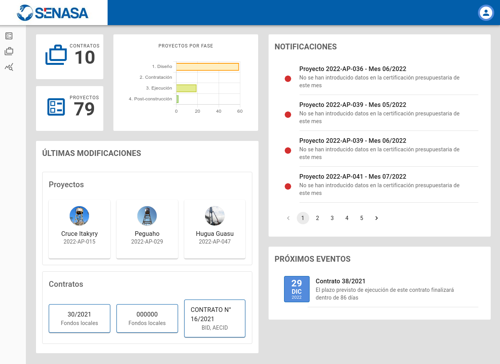

# SEPRAPS

**SEPRAPS**: _Seguimiento de la Ejecución de Programas Rurales de Agua Potable y Saneamiento_

Durante las últimas décadas, el [BID](https://www.iadb.org/es) (Banco Interamericano de Desarrollo) ha ejectuado y financiado proyectos de fortalecimiento sectorial en el ámbito del Agua Potable y Saneamiento (APS) en América Latina y el Caribe llegando a diferentes conclusiones:

-   Entre 1996 y 2017 el BID ha aprobado 37 operaciones por un monto total de US\$ 2,248 millones en el ámbito de APS en el sector rural.
-   En la mayoría de los países falta el desarrollo de una política pública específica para la atención al medio rural que reconozca y considere las particularidades de estas zonas.
-   La planificación a mediano y largo plazo se hace compleja por la falta de información suficiente sobre el número de sistemas y su estado de servicio.
-   La división de responsabilidades entre instituciones y la falta de coordinación entre ellas también puede influir negativamente en los resultados de los programas.
-   Respecto al diseño de las operaciones, el ámbito de intervención en las zonas rurales es muy variado y heterogéneo dependiendo del tamaño de la localidad rural.
-   Esta complejidad hay que tenerla en cuenta a la hora de definir, por ejemplo, esquemas de ejecución, tiempos y necesidades de supervisión.
-   En cuanto a la participación comunitaria y el acompañamiento social, si bien es un componente que está presente en todos los programas de APS rural en los últimos años, no siempre resulta en procesos de calidad y resultados satisfactorios.

Bajo ese prisma, una mejora identificada es que las instituciones que ejecuten los programas que financian dispongan de una herramienta TIC donde pueda ir haciendo el seguimiento de los proyectos. De esta forma, esta herramienta permitiría estandarizar lo máximo posible la ejecución de los proyectos definiendo una serie de fases e hitos comunes a cumplir, serviría además para realizar un control de los tiempos y los costes, y también obtener indicadores fiables para presentar resultados sobre las inversiones en financiación que realizan.

Tras un largo proceso de consultoría y apoyándose en algunas instituciones de referencia, en la que destaca [SENASA](https://www.senasa.gov.py) (Servicio Nacional de Saneamiento Ambiental) en Paraguay, el BID da forma a los requisitos que debería presentar esa herramienta y lanza una licitación pública en busca de una firma que la desarrolle. Ese es el origen de la aplicación SEPRAPS, que durante el año 2021 y 2022 es desarrollada por [iCarto](https://icarto.es/) y puesta en funcionamiento en modo de pruebas en la organización de SENASA.

## Repositorio

Este repositorio contiene la aplicación de SEPRAPS. SEPRAPS permite a una institución sectorial en el ámbito de la gestión de proyectos de agua y saneamiento en áreas rurales realizar el seguimiento de proyectos en gabinete a través del registro de información continua y actualización del estado. Entre sus características destacan:

-   Gestión de contratos
-   Gestión de proyectos independientes o dentro de los contratos
-   Seguimiento de certificaciones mensuales de ejecución de obras en los proyectos
-   Seguimiento de los proyectos a través del registro de hitos configurables
-   Repositorio documental configurable por cada tipo de proyecto
-   Agenda de contactos de proyectos y contratos
-   Asignación de perfiles de seguimiento a los usuarios

En estos momentos la aplicación está muy orientada a la metodología de trabajo de SENASA, la institución de referencia que ha sido seleccionada como piloto para este proyecto. SENASA, con una cartera de más de 250 proyectos potencialmente gestionables y diferentes departamentos de ejecución, ha servido como ejemplo, pero la herramienta se ha implementado de forma que pueda ser adaptada a otras instituciones a través de las diferentes posibilidades de configuración.

## Capturas

## Arquitectura

La aplicación está compuesta por los siguientes módulos

-   Aplicación front-end de seguimiento
-   Aplicación front-end de administración
-   Aplicación back-end de servicios

Ha sido implementada con la siguiente tecnología:

-   _PostgreSQL_ como gestor de base de datos
-   _Python_ como lenguaje principal de back-end
-   _Django_ como framework de desarrollo de back-end
-   _Django-Admin_ como módulo para la gestión de administración
-   _Javascript_ como lenguaje principal de front-end
-   _React_ como framework de desarrollo de front-end

## Desarrollo

Revisa HACKING.md para ver cómo comenzar a desarrollar en este proyecto y CONTRIBUTING.md para conocer las reglas que se siguen para aceptar contribuciones.
